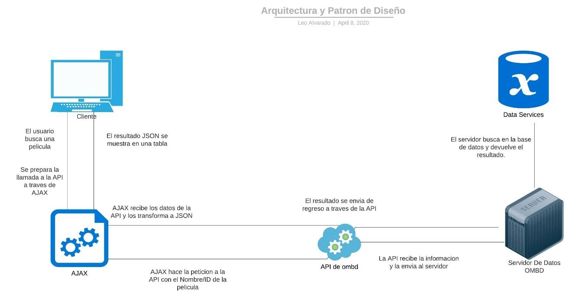
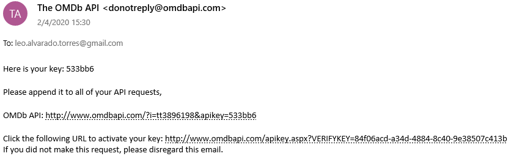
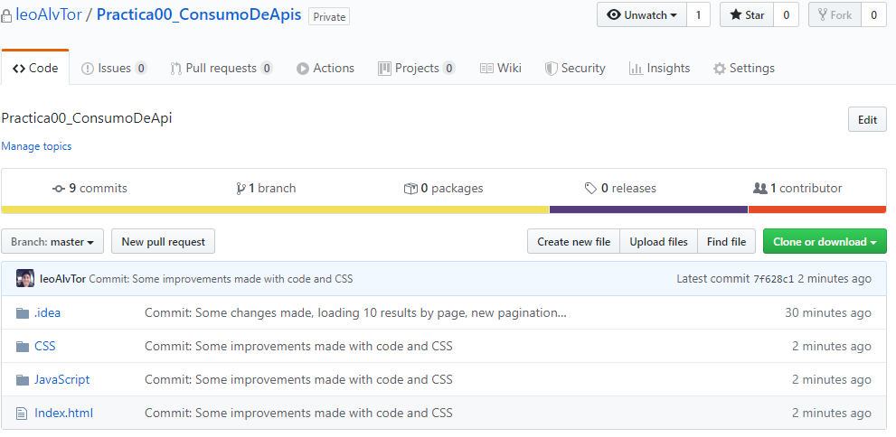
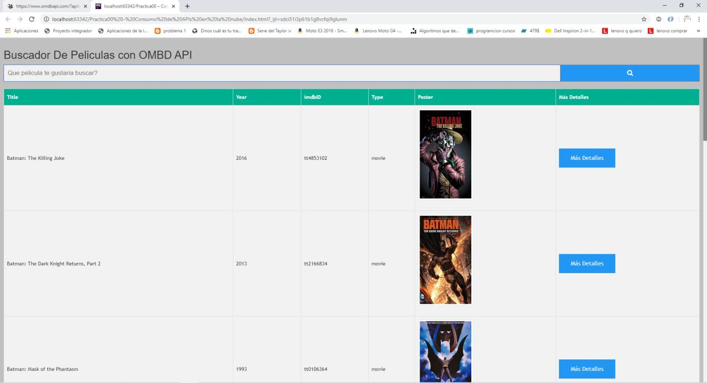
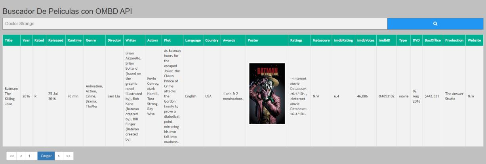
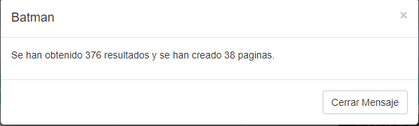
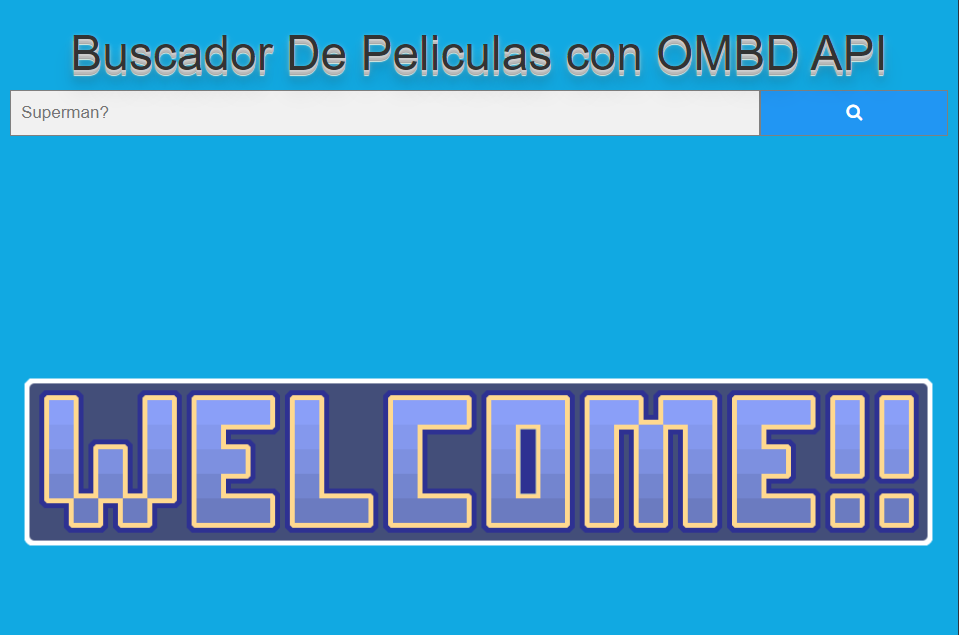
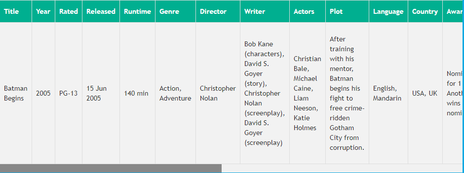
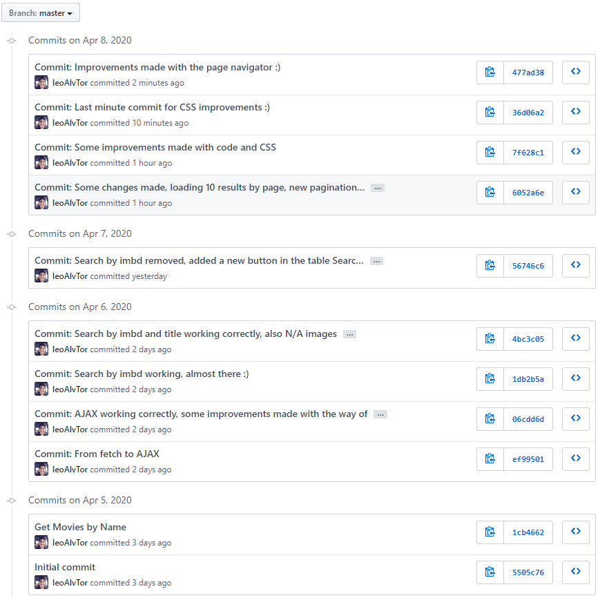

# Practica 0 Web Services y API

#### Identificar gráficamente la arquitectura y el patrón de diseño de la aplicación a desarrollar

#### Generar una llave para consumir los servicios web de la API de OMDb.

#### Crear un repositorio en GitHub con el nombre "Practica00 – Consumo de APIs en la nube"

#### Desarrollar una aplicación con HTML + CSS + Javascript + Web Services para buscar películas y toda su información de la base de datos de OMDb.

La aplicación Web debe permitir buscar la información de las películas tanto por el nombre (listado) como por el código (id) de cada película.
* Ejemplo de busqueda de la pelicula

#### Además, se deberá visualizar toda la información disponible (plot=full) de la base de datos de películas.
* Se muestra toda la informacion de la pelicula (plot=full)

#### También, la aplicación deberá presentar un máximo de 10 películas por búsqueda. Es decir, si la búsqueda retorna más de 10 películas se deberá paginar los resultados. Resultado de la búsqueda de la película Batman 
Se crea un footer automático que maneja únicamente el numero de paginas creadas. 

* Se muestra un dialogo en el que se dice cuantos resultados se obtuvieron y cuantas paginas se crearon.

* Tambien se crea la paginacion para moverse entre resultados.

#### Por último, la interfaz gráfica de aplicada debe ser intuitiva y sencilla aplicando conceptos de experiencia de usuario (justificar en el informe).
Interfaz inicial simple con una sola barra de búsqueda y un botón, ademas de que la barra de búsqueda muestra sugerencias de búsqueda automática.

La interfaz es responsive por lo que se adapta al tamaño del navegador web. 

La tabla de resultados es concisa para mostrando los detalles de la película de manera automática además de que se agrega un botón especial para obtener más información sobre la película que se seleccionó.
La tabla de detalles se muestra dentro de un scroll para que de esa manera se pueda visualizar todo sin agrandar toda la página web. 

Se puede navegar entre paginas de una manera muy fácil a través del footer en el que se puede elegir 5 opciones, primera página, última página, retroceder y avanzar una página, además de la opción de ir a cierta página directamente, si la página no existe entonces muestra un dialogo explicando el número de actual de entradas para que pueda ingresar un valor correcto. |

#### Commits en la herramienta GitHub

#### Enlace del repositorio en GitHub: https://github.com/leoAlvTor/Practica00_ConsumoDeApis.git

RESULTADO(S) OBTENIDO(S): Se pudo realizar la practica sin mayor problema, pero todavía existen ciertas dificultades al trabajar con API que no tengan una buena documentación ya que no se puede encontrar soluciones a ciertos problemas como obtener todas las películas con un título, sino que devuelven de 10 en 10, además de no contar con una opción para saber cuántas peticiones quedan disponibles.

CONCLUSIONES: Las API son una excelente herramienta que nos facilita la manera en la que nos comunicamos con los servicios de otras paginas web, además de que si son usadas con un patrón arquitectónico correcto no existe una mayor dificultad para manejar la información que se obtiene de las mismas.

RECOMENDACIONES: Es recomendable leer la documentación de una API antes de usarla ya que esto nos permite evitar errores que nos pueden llegar a tomar tiempo sin saber que es lo que ocurre, además se debe también tomar en cuenta a los usuarios de la aplicación ya para ellos la aplicación es nueva y debe ser sumamente intuitiva con la finalidad de evitar problemas de funcionamiento. 

##### Nombre de estudiante : Leonardo Alvarado Torres

Firma de estudiante :
 
 
